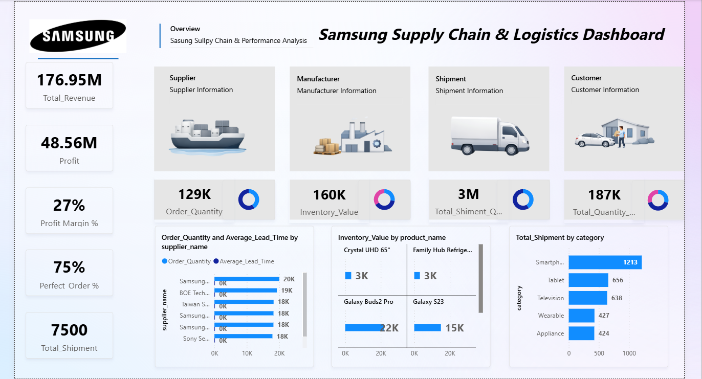

# AICTE-Project

# Samsung Supply Chain Dashboard 📊

A Power BI dashboard developed to analyze and visualize Samsung's supply chain and logistics performance.  
The dashboard provides insights into revenue, profit, inventory, shipment performance, and supplier contribution.

---

# 📌 Project Overview

Supply chain management involves multiple entities such as suppliers, manufacturers, shipments, and customers.  
Analyzing this data manually can be difficult and time-consuming.  

This project uses **Microsoft Power BI** to transform raw supply chain data into meaningful visual insights that help understand operational performance and support better business decisions.

---

# 🎯 Objectives

- Analyze Samsung's supply chain performance
- Monitor revenue and profit trends
- Evaluate supplier performance
- Track shipment and inventory distribution
- Provide a clear visual representation of logistics operations

---

# 🛠 Technologies Used

- **Microsoft Power BI Desktop**
- **Power Query**
- **DAX (Data Analysis Expressions)**
- **Data Visualization Techniques**

---

# 📊 Key Dashboard Metrics

- **Total Revenue:** 176.95M
- **Total Profit:** 48.56M
- **Profit Margin:** 27%
- **Perfect Order Rate:** 75%
- **Total Shipments:** 7500
- **Total Order Quantity:** 129K
- **Inventory Value:** 160K
- **Customer Demand Quantity:** 187K

---

# 📈 Dashboard Features

- KPI Cards for business performance indicators
- Supplier order quantity analysis
- Inventory distribution by product
- Shipment category analysis
- Interactive visualizations for better insights

---

# 🖼 Dashboard Preview

*(Add your screenshot image in the repository and name it dashboard.png)*

---

# 📊 Key Insights

- Smartphones have the highest shipment volume among all product categories.
- Samsung supplier contributes the highest order quantity.
- The business maintains a strong profit margin of **27%**.
- Inventory distribution shows higher stock levels for premium products.

---

# 🚀 Future Improvements

- Integration with real-time supply chain data
- Predictive analytics for demand forecasting
- Shipment tracking using geographical maps
- AI-based supply chain optimization

---

# 📚 References

- Microsoft Power BI Documentation  
https://learn.microsoft.com/power-bi

- Microsoft Elevate AICTE Internship Learning Resources

---

# 👨‍💻 Author

**Parth Vinodkumar Lad**

Microsoft Elevate AICTE Internship – Power BI Project
